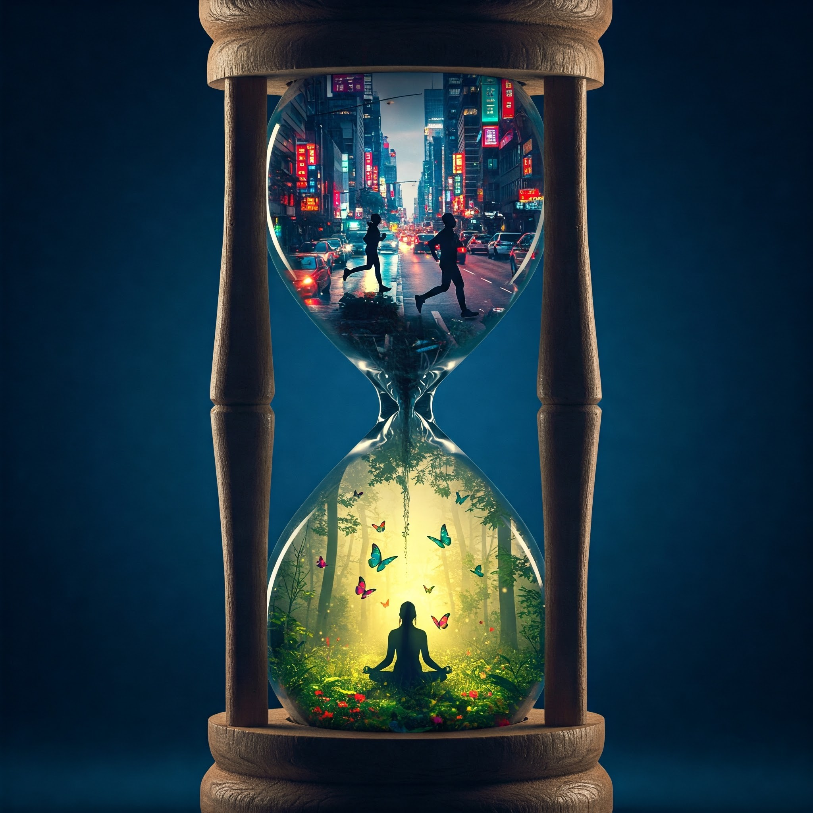

### Uppgift 1
## Skapa en AI genererad bild:

Ett förstorad timglas som tar upp största delen av bilden men ändå har luft över och under själva timglaset. Timglaset är utsnidat ur tunt och elegant trä, står mot en skymningsblå bakgrund. Inga andra element stör dess närvaro, vilket ger en drömlik, nästan tidlös känsla. 

I den undre delen av timglaset breder en hyperrealistisk skogsglänta ut sig, badande i ett mycket mjukt, varmt ljus. Här svävar färgstarka fjärilar graciöst genom luften, omgivna av frodig grönska och skimrande dagg på bladen. En kvinnlig siluett sitter i mitten och utför meditation. Färgtonerna är naturliga och harmoniska, och atmosfären andas stillhet och frid. 

Den övre delen av timglaset fångar en hektisk, kaotisk och stressig stadsmiljö där bilar rusar fram, en siluett av en kvinna korsar vårdslöst gatan med bilar runt omkring. Neonljus blinkar i skarpa, intensiva färger. Kalla blå och röda nyanser dominerar, och scenen pulserar av rörelse och rastlös energi. 

Mellan dessa två världar finns ingen skarp gräns – stadens kaos rinner långsamt ner genom timglasets smala midja där asfalten brutits upp precis vid övergången. Övergången upplöses gradvis och omvandlas genom rinnande lövverk ner till den fridfulla skogsgläntan. Som om stressen långsamt förångas och omvandlas till stillhet, en visuell metafor för övergången från jäkt till harmoni.

